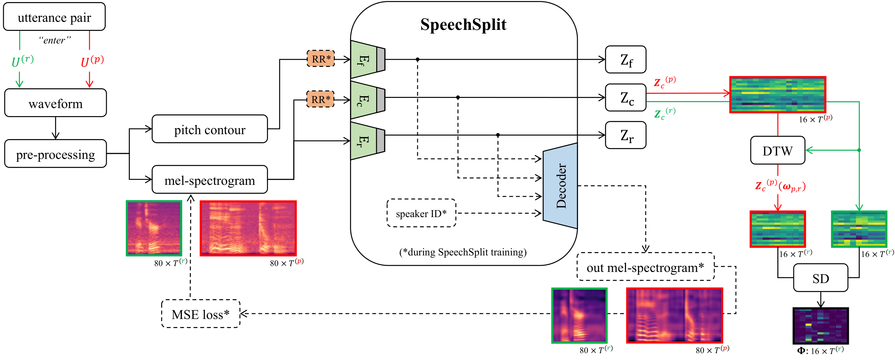

# ***Disentangled Latent Speech Representation for Automatic Pathological Intelligibility Assessment***



## **Introduction**

This is the code repository for the paper ***Disentangled Latent Speech Representation for Automatic Pathological
Intelligibility Assessment***, which can be found [here](https://arxiv.org/abs/2204.04016), which was submittet to Interspeech 2022.

It utalizes an existing architecture, originally desined with Voice Conversion in mind ([SpeechSplit](https://arxiv.org/abs/2004.11284)). However, for this work it is trained differently from the original implementation and only the encoder outputs are used to extract certain latent speech representations. These can then be used in a final step to determine a (pathological) speaker's intelligibility value based on a reference signal.

Please kindly cite our work if you find this repository useful:

```
@article{weise2022disentangled,
  title = {Disentangled Latent Speech Representation for Automatic Pathological Intelligibility Assessment},
  author = {Weise, Tobias and Klumpp, Philipp and Maier, Andreas and Noeth, Elmar and Heismann, Bjoern and Schuster, Maria and Yang, Seung Hee},
  journal = {arXiv preprint arXiv:2204.04016}
  url = {https://arxiv.org/abs/2204.04016},
  year = {2022},
}
```

## **Requirements**
Refer to the requirements.txt file.

## **Data**

In principle any dataset can be used for the training of the SpeechSplit architecture (i.e., especially the encoders) of this approach. However, we created and used a subset of the English [Common Voice](https://commonvoice.mozilla.org/en) corpora, in order to enable the encoders to learn general speech features. For more details please refer to the original paper. The custom dataset can be provided upon request if desired. 

For evaluating and predicting subjective intelligibility scores the [UASpeech](http://www.isle.illinois.edu/sst/data/UASpeech/) corpora was used. 

## **Training**
For training please refer to the original speechsplit repository - only hyperparameters changed for training of this paper and the used data of course.

## **Inference**

Inferencer class can be used for performing inference with the trained SpeechSplit model, in order to extract the three embeddings. If you want to use the weights that were trained as described in the paper, simply send us a request and we will provide them. 

## **Intelligibility**

For intelligibility functions/experiments please have a look at the intelligibility.py file and the functions contained in it.
